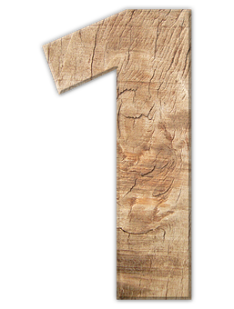
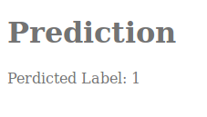

# digit-recognizer-webapp
Flask Web Application for deploying a digit recognizer model built using PyTorch.  
Only works for digits from 0 - 9.

# Models Accuracy on each digit
Test Accuracy of     0: 99% (977/980)  
Test Accuracy of     1: 99% (1132/1135)  
Test Accuracy of     2: 99% (1026/1032)  
Test Accuracy of     3: 99% (1006/1010)  
Test Accuracy of     4: 99% (974/982)  
Test Accuracy of     5: 99% (888/892)  
Test Accuracy of     6: 98% (940/958)  
Test Accuracy of     7: 98% (1016/1028)  
Test Accuracy of     8: 99% (967/974)  
Test Accuracy of     9: 98% (991/1009)  

# Overall Test Accuracy
Test Accuracy (Overall): 99% (9917/10000

# Simple home page and predictions page
# Upload Image Page

# Uploaded Image

# Predicted Label

