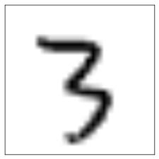
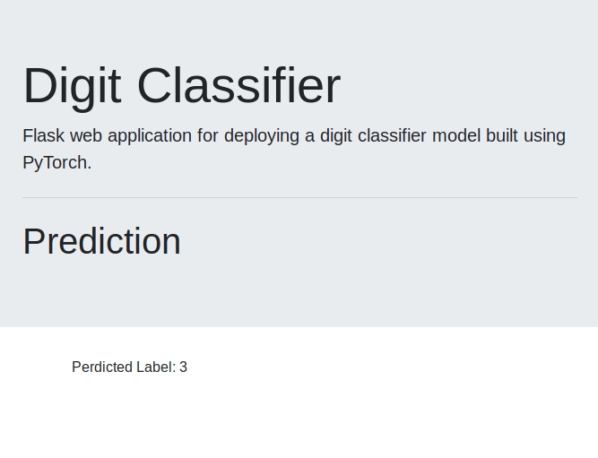

# digit classifier web application
> Flask web application for deploying a digit classifier model built using   PyTorch.  

>Only works for digits from 0 - 9.

# run locally
>$ pip3 install -r requirements.txt  
>$ python3 run.py

# model's accuracy on each digit
> Test Accuracy of 0: <b> 99% </b>

> Test Accuracy of 1: <b> 99% </b>

> Test Accuracy of 2: <b> 99% </b>

> Test Accuracy of 3: <b> 99% </b>

> Test Accuracy of 4: <b> 99% </b>

> Test Accuracy of 5: <b> 99% </b>

> Test Accuracy of 6: <b> 98% </b>

> Test Accuracy of 7: <b> 98% </b>

> Test Accuracy of 8: <b> 99% </b>

> Test Accuracy of 9: <b> 98% </b>

# overall test tccuracy
> Test Accuracy : <b> 99% </b>

# home page and predictions page
> Upload Image Page  

> Uploaded Image  

> Predicted Label  

# unique files in the project
> architecture.py  
Contains the classifier model's <b>architecture class</b> necessary when   loading the model's checkpoint.   Also contains two methods, <b> get_model() </b>, which loads and returns the model,   and <b> get_tensor() </b> method with takes as a parameter image bytes   from uploaded image, transforms the image's size and color to grayscale,   then returns a tensor.

> inference.py  
Contains the <b> get_image_label() </b> method which passes image bytes through   the <b> get_tensor() </b> method, the returned tensor through the model and   returns the <b> predicted label </b>.
